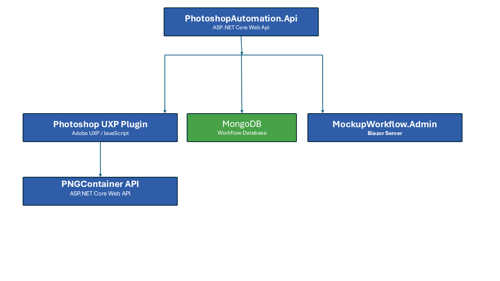
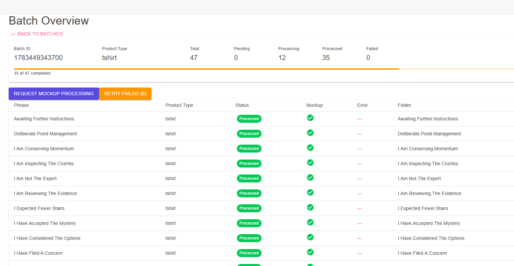
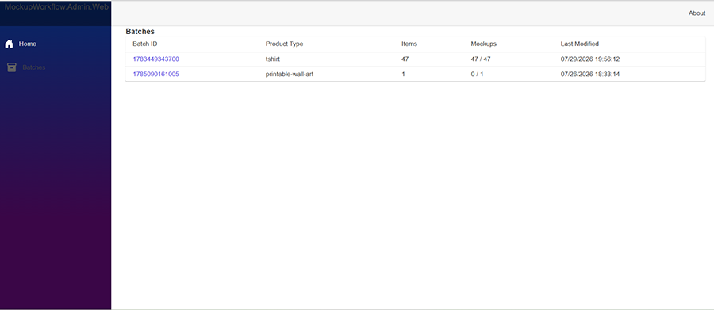

# MockupWorkflow.Admin

MockupWorkflow.Admin is the Blazor Server administration application for the Mockup Workflow Platform. It provides a centralized interface for importing production batches, monitoring workflow progress, reviewing processing status, and managing automated Photoshop production workflows.

The application integrates with PhotoshopAutomation.Api and supporting platform services to coordinate batch processing, monitor workflow execution, and provide operational visibility across the automation pipeline.

## Overview

MockupWorkflow.Admin is the operational dashboard for the Mockup Workflow Platform. It enables operators to import production batches, monitor workflow execution, review processing status, diagnose failures, and manage automated Photoshop production workflows from a centralized Blazor Server application.

---

## Features

### Batch Import

- Import workflow records from JSON manifests
- Automatically generate and assign batch identifiers
- Select product type during import
- Validate imported records before processing
- Store workflow records in MongoDB

### Batch Monitoring

Monitor every production batch from a centralized dashboard, including:

- Batch ID
- Product type
- Record count
- Processing status
- Mockup generation status
- Last modified timestamp

This provides operators with real-time visibility into workflow progress.

### Workflow Management

Track workflow execution across multiple processing stages, including:

- Imported
- Pending
- Processing
- Completed
- Failed

Individual records expose detailed processing information to simplify troubleshooting and recovery.

### Folder Provisioning

Following a successful import, the application automatically calls the FolderCreator API to provision the required production folder structure for each batch. This eliminates manual setup and ensures a consistent directory layout across the workflow platform.

### Platform Integration

MockupWorkflow.Admin coordinates with the platform's backend services through REST APIs, including:

- PhotoshopAutomation.Api
- FolderCreator.API
- PNGAPI
- MongoDB

Together these services provide an end-to-end workflow for managing production batches and automated asset generation.

### Responsive Blazor Interface

Built with Blazor Server and MudBlazor, the administration interface provides:

- Interactive data tables
- Live status updates
- Batch detail pages
- Import workflows
- Responsive layouts
- Material Design components
---

## Architecture

MockupWorkflow.Admin serves as the operational dashboard for the Mockup Workflow Platform. It provides a web-based interface for importing workflow records, monitoring batch execution, reviewing processing status, and coordinating automated production workflows.

The application communicates with the platform's backend services through REST APIs while persisting workflow data in MongoDB.

  

## Workflow Overview

The administration application supports the complete operational workflow:

1. Import workflow records from JSON.
2. Validate and persist records in MongoDB.
3. Automatically provision production folders.
4. Monitor batch processing.
5. Review individual record status.
6. Track Photoshop mockup generation.
7. Verify generated assets.
8. Prepare completed batches for downstream publishing.

### Service Responsibilities

| Component | Responsibility |
|-----------|----------------|
| **MockupWorkflow.Admin** | Blazor Server administration interface for operators |
| **PhotoshopAutomation.Api** | Coordinates workflow execution and batch processing |
| **FolderCreator.API** | Creates standardized production folder structures |
| **PNGAPI** | Manages input and generated asset storage |
| **MongoDB** | Stores workflow records, batch metadata, and processing state |
---

## Technology Stack

* ASP.NET Core
* Blazor Server
* MudBlazor
* MongoDB
* Docker
* REST APIs
* C#

---

## Related Projects

### MockupWorkflow.Shared

Shared business models, MongoDB collections, and workflow objects.

### PhotoshopAutomation.Api

REST API responsible for importing production records, managing batches, and coordinating workflow processing.

### FolderCreator.API

Creates and manages batch folder structures within the shared Docker volume.

---

## Current Workflow

1. Import production records.
2. Generate a batch ID.
3. Save workflow records to MongoDB.
4. Automatically create production folders.
5. Monitor batches and individual records.
6. Generate Photoshop mockups through the UXP workflow engine.
7. Upload generated assets through PNGAPI.
8. Review completion status and processing errors.
9. Prepare completed batches for downstream publishing.

---

## Project Status

**Status:** Active Development / Portfolio Release

The core operational workflow is functional, including batch import, folder provisioning, workflow monitoring, Photoshop mockup processing, generated-asset uploads, and completion tracking.

Current development is focused on:

- Refining the administrative user experience
- Expanding workflow integrations
- Enhancing production monitoring and diagnostics
- Supporting additional publishing and automation pipelines

---

## Screenshots

### Workflow Monitoring

The Workflow Monitoring page provides operators with detailed visibility into batch progress, processing status, mockup generation, and item-level workflow execution.

  

### Batch List

The Batch List provides a high-level operational view of all production batches, including product type, item counts, mockup progress, and last activity.

  

### Planned UI Improvements

- Simplify the batch import experience
- Separate specialized import workflows from the core platform
- Improve onboarding for first-time users
- Add guided validation and import progress feedback
